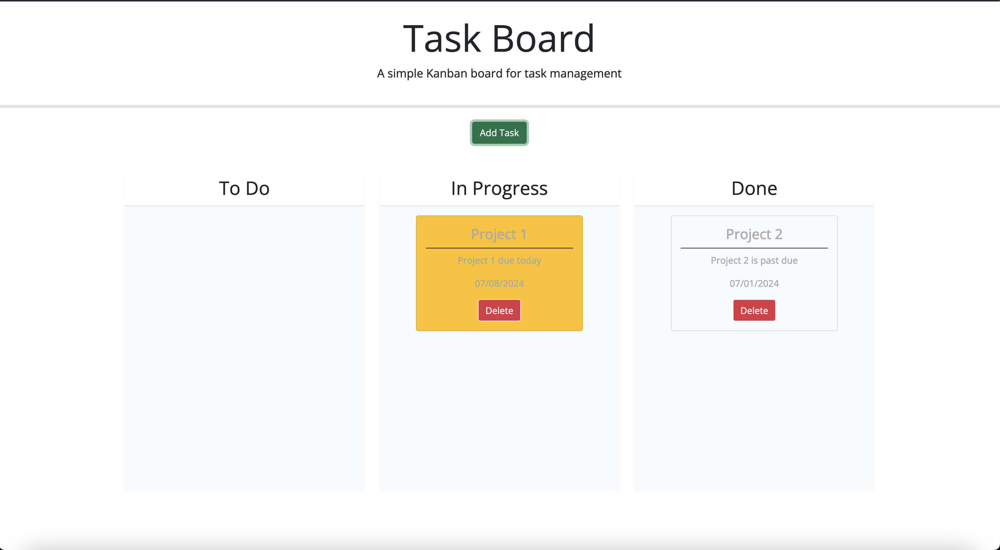
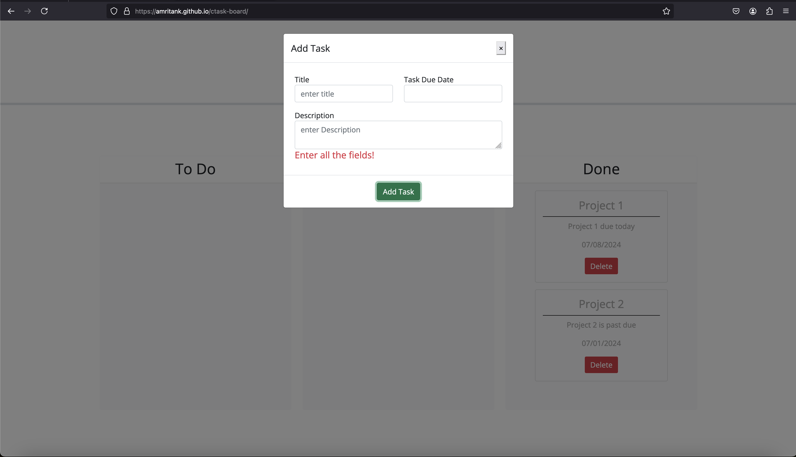

# Kanban Board

## Description
A kanban board implementation to manage tasks.

## Usage
1. Upon launching the webapp, the board will lists the tasks that are store in localstorage if any. Tasks due today are yellow, red is for tasks past due and white is for tasks due in the future.

2. A User can add a new task by clicking on the Add Task button which will display a modal asking for user inputs.

3. If a user fails to enter any of the fields, an error message will be displayed and the modal will remain open.

4. Upon filling all the fields, the user can click on the Add Task button in the modal and the new task will be added to the To-do list.

5. User can also move the taks between the other lanes (in-progress and done) to reflect the different state of the tasks. 
![alt_text](assets/images/task-move.png

6. A task when marked done will turn white in color. 

## Installation
N/A

## Usage
In order to view the portfolio page visit: https://amritank.github.io/ctask-board/

## License
Please refer to the LICENSE in the repo.

